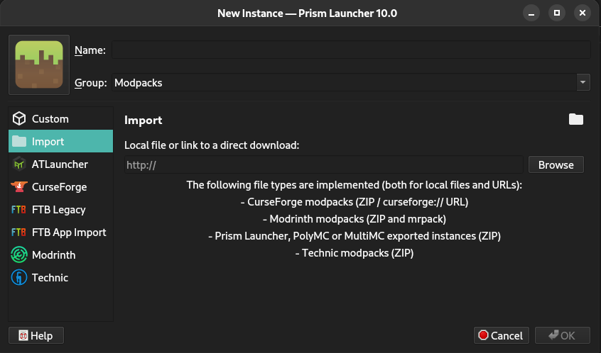

# :sparkles: LVLup Modpack

An experimental modpack I sometimes work on.

> [!IMPORTANT]
> This project is just for fun.  
> Nothing high-professional or anything.  
> Just easier to manage/update this way.

## Table of contents

Here a small listing of all contents.

1. [Introduction](#1-introduction)
2. [Installation](#2-installation)
3. [Maintaining](#3-maintaining)
4. [LICENSE AND LAW](#3-license-and-law)

## 1. Introduction

Hey, I'm LVLup, a constant work-in-progress modpack.  
I convey a medieval, mythical and magical feeling.  
My bare-existence is to serve fun for the people using/exploring me. :)  
But beware! I cannot guarantee you'll like me as a modpack as much as others.  
  
Critics can be discussed in [Issues](https://github.com/lunarydess/Minecraft-Modpack-LVLup/issues).  
Optimizations can be made with [Pull requests](https://github.com/lunarydess/Minecraft-Modpack-LVLup/pulls).

## 2. Installation

First of all ensure you have a JDK above 17 installed.  
I personally recommend using Java 23.  

There are different approaches of how you can install me.  
Using a [MultiMC](https://multimc.org/) based launcher like [PrismLauncher](https://prismlauncher.org/) is the easiest way.  
If you want to use the normal launcher it'll be more complex but sure, go ahead.  

### MultiMc based launchers

You really just need to paste the link of the instance from the releases section via the import function:  

### Minecraft Launcher

  TODO

## 3. Maintaining

You will need [packwiz](https://packwiz.infra.link/) for maintaining/contributing to this modpack.  
The official docs can be found [here](https://packwiz.infra.link/tutorials/creating/adding-mods/).

## 4. LICENSE AND LAW

This project is licensed under the [Unlicense License](/LICENSE).  
Please respect the license and contributors behind this project.
